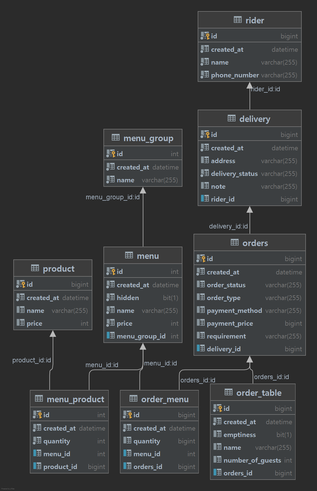
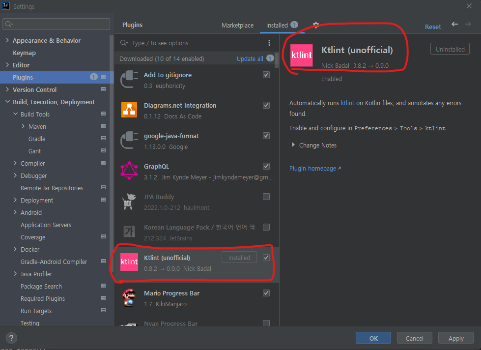
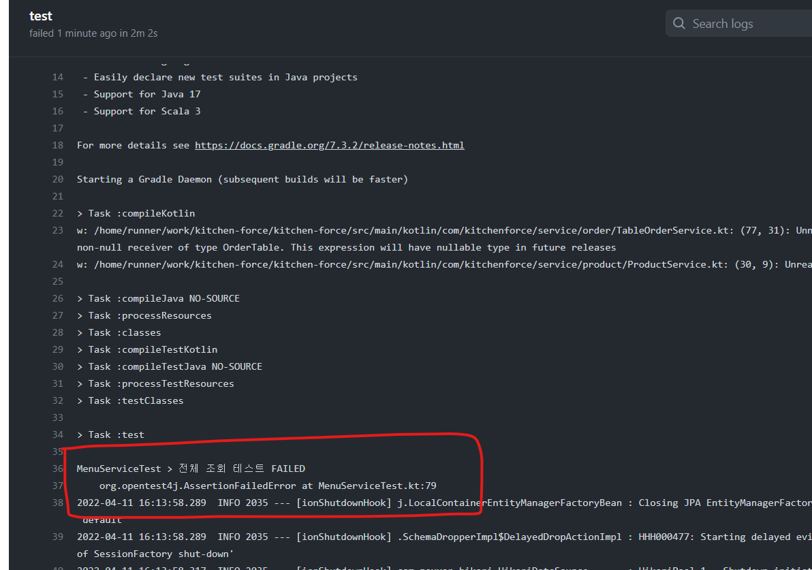
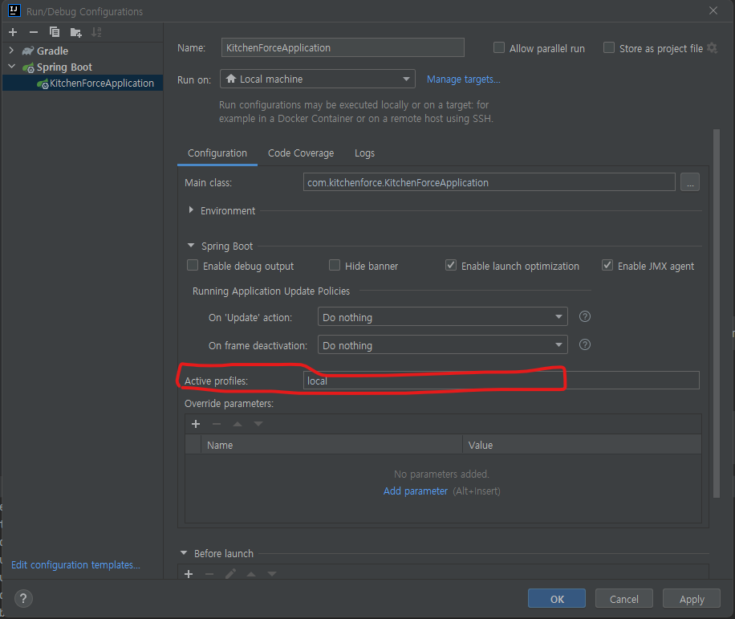

# kitchen-force

## Reference
* Next-step의 ddd-tactical-design 레포지토리의 요구사항을 참고 
  * https://github.com/next-step/ddd-tactical-design
  * 일종의 요식업 POS기 비즈니스라고 보시면 될 것 같습니다.
* 대부분의 구현 기능들은 해당 프로젝트에서 차용해왔으나 일부 변주를 준 기능이 있습니다.
> 기획을 정리한 문서는 현재 없다고 보시면 됩니다.
---

## BackEnd 

### Tech Sepc
* Kotlin 1.6.0 (JDK 11)
* gradle 
* SpringBoot 2.6.2
  * Spring Web(Servlet Stack)
    * Rest-Controller 원칙
  * Spring Data Jpa
* RDBMS : MySQL 8.0
  * TEST DB는 H2 인메모리 DB 사용

### ERD
* ```ddl-auto``` 를 활성화 하였으므로 Application의 Entity Model 설계가 변경될 때마다 물리 테이블도 유동적으로 변경 될 것으로 보입니다.


### (필독) 개발 컨벤션 / 그라운드 룰
* Rest API 서버를 타게팅 하고 있습니다. 
* 작업은 ```develop``` 브랜치에서 작업 브랜치를 생성해서 진행해주세요,
  * Git 전략은 각자 편한 방식으로 하되 ```develop``` 또는 ```master```에 Force Push 하는 것을 삼가해주세요
  * 권장드리는 방식은 Fork를 떠서 PR을 하는 방식을 추천드립니다.
  * Mac / Linux을 사용하고 계신다면 [Git-Flow](https://techblog.woowahan.com/2553/)도 추천드립니다.
* ```develop``` 병합 전에 PR 코드 리뷰를 필수적으로 진행했으면 합니다.
  * 이전에는 인원이 많이 없어서 코드리뷰를 많이 생략했지만, 참여 인원이 많은 만큼 적어도 1명 이상의 리뷰확인 프로세스를 도입해보는게 어떨까 싶네요
* Intellij Plugin KtLint를 설치해주시고, Push 전에 린트 체크 부탁드립니다.

* 가급적 리팩토링/기능개발 후 **단위테스트**를 작성해주시는걸 권장드립니다. 테스트실패시 PR-Merge가 불가능 합니다.
  * 커버리지 100%를 지향하면 좋겠지만, 현실적으로 그건 어려우니 최대한 의식적으로 테스트에 신경쓰면서 개발하도록 합니다.
    * [이런거(TDD 연습)](https://www.youtube.com/watch?v=cVxqrGHxutU)라든지, [요런것(커버리지 100%)](https://www.youtube.com/watch?v=jdlBu2vFv58)들에 대해서 관심이 있으신 분들이라면 제가 능력이 되는 한 최대한 서포트 해드리겠습니다.
  * 4/12 기준으로 테스트가 많이 빈약합니다. 토이 프로젝트라서 테스트에 대한 관심을 많이 두지 않아 기술부채로 남아있는데 시간 날때마다 짬짬이 매꿔보도록 하겠습니다.
  * 참고
    * https://www.baeldung.com/kotlin/spring-boot-testing
    * https://techblog.woowahan.com/5825/


* Table 추가시 PK는 `Auto-Increment(Sequence)` 를 원칙으로 합니다.
* JPA 기본 ORM을 활용하며, 조인이 필요한 경우 JPA의 연관관계 매핑을 이용하는 것을 권장드립니다.
  * 정 ORM으로 안풀리는 요건들은 JPQL이나 ```@Query```를 사용하셔도 무방합니다.
* 비즈니스 로직 작성시 명령형(Imperative) 방식 보다는 함수형(Functional) 방식을 지향합니다.
  * Collection이나 loop를 함수형 스타일로 구현하는게 익숙하지 않다면, 일단 명령형으로 작성해보고 함수형으로 마이그레이션 해보는 연습을 해나가는것을 권해드립니다.  
  * [명령형과 함수형 프로그래밍 개념 차이 참고](https://velog.io/@kyusung/%ED%95%A8%EC%88%98%ED%98%95-%ED%94%84%EB%A1%9C%EA%B7%B8%EB%9E%98%EB%B0%8D-%EC%9A%94%EC%95%BD)

### 스프링 부트 실행 방법
* active profile option을 ```local```로 지정하여 실행


### Docker
> 필수 : 로컬 개발 환경에 각자 OS에 맞는 Docker Engine 구성이 필요함
* 
* 도커 컨테이너 실행하기
```bash
$ cd $PROJECT_DIR
$ docker-compose up -d
```

* 컨테이너 종료
    * Volumn을 초기화 하지 않으면 남은 데이터는 저장됨

```bash
$ docker-compose down
```
* 볼륨 마운트까지 제거시 ```-v``` 옵션 추가
    * 이러면 DB에 저장된 값도 날라감.

```bash
$ docker-compose down -v
```

* 서버 어플리 케이션 도커 빌드(로컬)
  * imagename = kitchen-force-api 
  * 빌드시 자동화 된 테스트 돌리기 추가
  ```bash
  $ ./gradlew clean test bootBuildImage --imageName kitchen-force-api
  $ docker run --network="host" -e spring.profiles.active=local --rm -p 8080:8080 kitchen-force-api
  ```
  * windows10
    * 


### 단위테스트 실행

* 
* github Action workflow와 연동이 되어 테스트 pass가 안되면 PR Merge가 어렵습니다.
* PR을 올리기전 체크 부탁드립니다.
```
$ gradlew test
```


---

## FrontEnd
* 사전 준비사항 : 각자 OS에 맞는 npm 환경이 구성이 되어 있어야 함.
* 기술 스택
  * React + TypeScript
  * ReactHooks
  * UI : Antd

* 실행 방법
```
cd frontend
npm install
npm start run
```
* http://localhost:3000