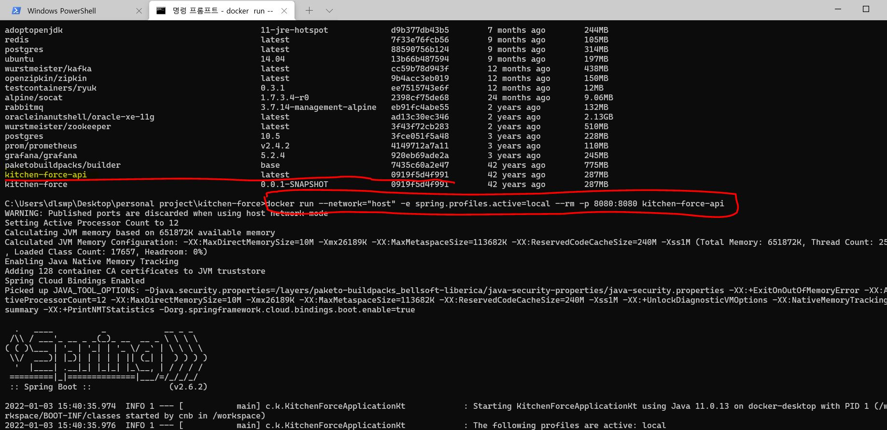

# kitchen-force


## Docker
> 필수 : 로컬 개발 환경에 각자 OS에 맞는 Docker Engine 구성이 필요함
* 
* 도커 컨테이너 실행하기
```bash
$ cd $PROJECT_DIR
$ docker-compose up -d
```

* 컨테이너 종료
    * Volumn을 초기화 하지 않으면 남은 데이터는 저장됨

```bash
$ docker-compose down
```
* 볼륨 마운트까지 제거시 ```-v``` 옵션 추가
    * 이러면 DB에 저장된 값도 날라감.

```bash
$ docker-compose down -v
```

* 서버 어플리 케이션 도커 빌드(로컬)
  * imagename = kitchen-force-api 
  * 빌드시 자동화 된 테스트 돌리기 추가
  ```bash
  $ ./gradlew clean test bootBuildImage --imageName kitchen-force-api
  $ docker run --network="host" -e spring.profiles.active=local --rm -p 8080:8080 kitchen-force-api
  ```
  * windows10
    * 